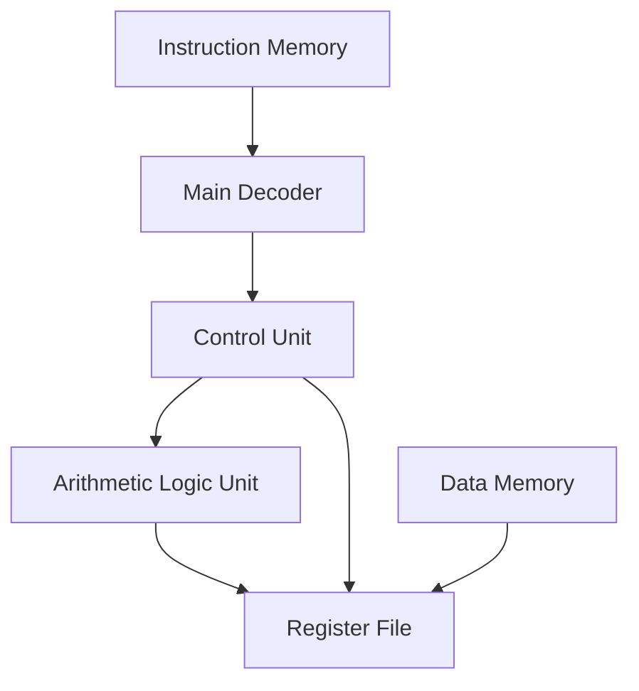
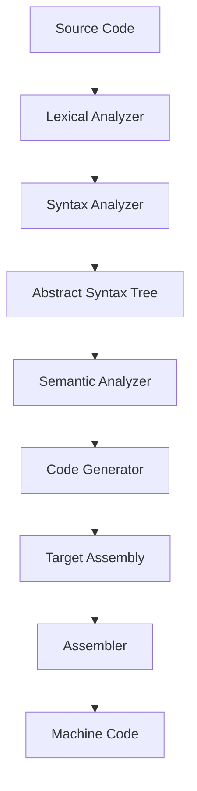

# Architecture UML

This document outlines the high-level architecture of both the
hardware CPU and the software compiler toolchain.

## Hardware Architecture

```mermaid
graph TD;
    ALU[Arithmetic Logic Unit] --> RegFile[Register File];
    ControlUnit[Control Unit] --> ALU;
    ControlUnit --> RegFile;
    MainDecoder[Main Decoder] --> ControlUnit;
    InstMem[Instruction Memory] --> MainDecoder;
    DataMem[Data Memory] --> RegFile;
```

## Compiler Architecture

```mermaid
graph TD;
    SourceCode[Source Code] --> Lexer[Lexical Analyzer];
    Lexer --> Parser[Syntax Analyzer];
    Parser --> AST[Abstract Syntax Tree];
    AST --> Semantic[Semantic Analyzer];
    Semantic --> CodeGen[Code Generator];
    CodeGen --> Assembly[Target Assembly];
    Assembly --> Assembler[Assembler];
    Assembler --> MachineCode[Machine Code];
```
